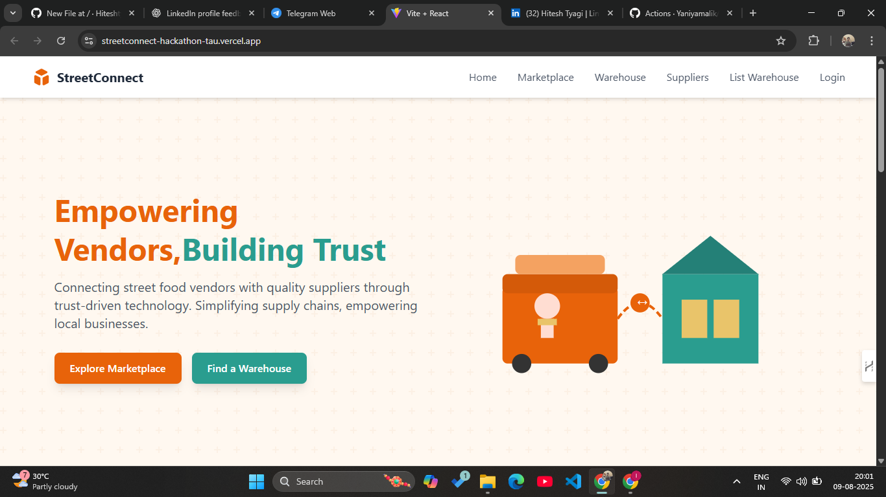

# Street Connect

**Street Connect** is a MERN-based platform designed to connect communities, local authorities, and service providers to address urban challenges efficiently. It enables users to report issues, share updates, and collaborate for better city living.

🔗 **Live Demo**: [Street Connect](https://streetconnect-hackathon-tau.vercel.app/)

---

## 🚀 Features

- **Issue Reporting**: Report street problems like potholes, waste management, or lighting faults.
- **Community Collaboration**: Residents can view and support reported issues.
- **Real-Time Updates**: Authorities can update the status of each reported problem.
- **User Authentication**: Secure login and signup for users.
- **Responsive Design**: Accessible across devices.

---

## 🛠️ Tech Stack

- **Frontend**: React.js, HTML5, CSS3, JavaScript
- **Backend**: Node.js, Express.js
- **Database**: MongoDB
- **Other Tools**: Mongoose, Axios

---

## 📸 Preview

  

---
## 📫 Connect With Me
- **LinkedIn**: [Hitesh Tyagi](https://www.linkedin.com/in/hitesh-tyagi-1838a4282/)
- **GitHub**: [hiteshtyagi610](https://github.com/hiteshtyagi610)

